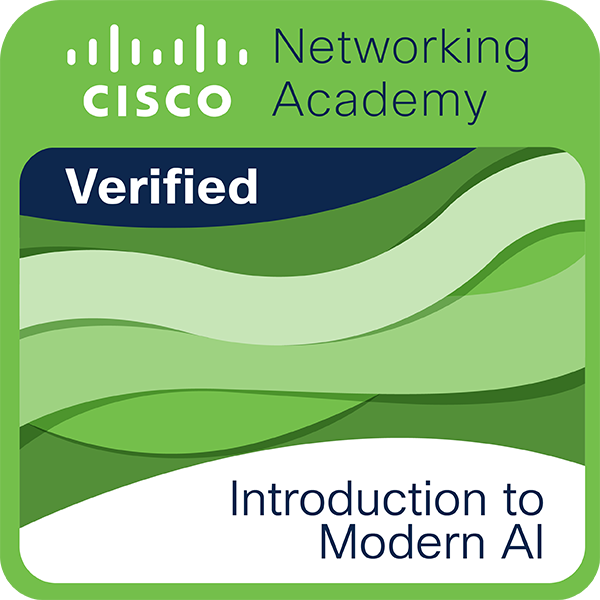

# 🚀 AI/ML Portfolio Website

## 👨‍💻 About

This is my personal portfolio website showcasing my journey as a future AI/ML Engineer.
It includes my projects, certifications, and contact details.

---

## ✨ Features

* Animated particle background
* Typing effect (AI-style intro)
* 3D hover effects
* Dark mode toggle
* Multi-page responsive website
* Certificate showcase (PDF + Image)
* Social media integration

---

## 📁 Project Structure

```
portfolio/
│
├── index.html
├── about.html
├── projects.html
├── contact.html
├── styles.css
├── script.js
│
├── certificates/
│   ├── Certificate.pdf
│   ├── Google.pdf
│   ├── Matlab.pdf
│   ├── YUVA AI.pdf
│   ├── IntrotoModernAI.pdf
│   └── introduction-to-modern-ai.png
│
├── profile picture/
│   └── my photo.jpeg
│
└── README.md
```

---

## 🖼️ Certificates Section

### 📌 How certificates are stored

* PDFs are inside `/certificates`
* Image preview also included (`.png`)

---

### 📌 How to display certificates

Add this in your **about.html**:

```html
<h2>My Certificates</h2>

<ul>
  <li><a href="certificates/Certificate.pdf" target="_blank">Certificate</a></li>
  <li><a href="certificates/Google.pdf" target="_blank">Google Certificate</a></li>
  <li><a href="certificates/Matlab.pdf" target="_blank">MATLAB Certificate</a></li>
  <li><a href="certificates/YUVA AI.pdf" target="_blank">YUVA AI Certificate</a></li>
</ul>


```

---

## 🛠 Setup

1. Clone or download this repository
2. Open in VS Code
3. Replace:

   * Your name
   * Profile image
   * Social links
   * Email & phone number

---

## 🌐 Deployment (GitHub Pages)

1. Go to **Settings**
2. Click **Pages**
3. Select branch → Save
4. Your site will be live

---

## 🎯 Customize

* Add more certificates in `/certificates`
* Add real projects in `projects.html`
* Update About section with your skills
* Improve styling in `styles.css`

---

## 💡 Important Tip

Certificates are good, but projects are more important.
Try to build at least:

* 1 Machine Learning project
* 1 Python project
* 1 Data analysis project

---

## 📬 Contact

* Instagram: your link
* Facebook: your link
* Email: your email
* Phone: your number

---

⭐ Built as part of my journey to become an AI/ML Engineer
